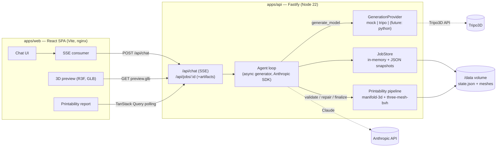

# Drukar

> _Drukar_ (друкар, Ukrainian) — "printer / printmaker".

An AI agent that turns a plain-text description into a **print-ready** 3D model file.

The differentiator is not generation quality (generation is delegated to external APIs) but the
guarantee that the output prints successfully on the first try:

**requirement clarification → generation → automated printability validation → light repair → export.**

If a mesh cannot be fixed cheaply, the agent regenerates with an adjusted prompt instead of
attempting heavy repair — regeneration is cheaper than surgery.

## Architecture



## Quick start

```bash
pnpm install
cp .env.example .env       # defaults run fully offline (mock provider)
pnpm dev                   # api on :3000, web on :5173
```

Or with Docker:

```bash
docker compose up          # web on :8080, api on :3000
```

For live runs set `ANTHROPIC_API_KEY` (agent) and optionally `DRUKAR_PROVIDER=tripo` +
`TRIPO_API_KEY` (real 3D generation) in `.env`.

## Printability pipeline standalone

The pipeline is the product's IP and runs without the rest of the app:

```bash
pnpm pipeline:run path/to/mesh.stl     # also accepts .glb / .obj
```

It prints a per-check report (manifold, wall thickness, overhangs, build volume), applies light
repair and auto-orientation, and writes `model.stl` + `preview.glb` next to the input.

## Swapping generation providers

Set `DRUKAR_PROVIDER=mock|tripo`. Providers implement one interface
(`apps/api/src/providers/types.ts`):

```ts
interface GenerationProvider {
  generate(prompt: string, options: GenOptions): Promise<{ meshPath: string; format: 'glb' | 'stl' | 'obj' }>;
}
```

### Where Python / local inference plugs in later

If the "% of first-try successful prints" metric degrades due to weak mesh repair, a
`drukar-mesh` service (FastAPI + trimesh) is added as **another implementation of the same
interface** — an HTTP provider/repair backend behind `DRUKAR_PROVIDER=python`. No other module
changes. See `TODO(python)` markers in `apps/api/src/providers/index.ts`.

## Repository layout

- `apps/web` — React SPA: chat, 3D preview, report (no SSR, no router)
- `apps/api` — Fastify: agent loop, providers, printability pipeline, jobs, SSE
- `packages/shared` — zod schemas + TS types shared by both

## Tests

```bash
pnpm test
```

Everything runs offline: the printability pipeline uses programmatically generated meshes (no
binary fixtures), the agent loop uses a scripted mock LLM client and the mock provider.

## Out of scope for MVP

Auth, payments, print-farm integration, G-code slicing, 3MF export, heavy mesh repair (voxel
remeshing), Redis/queues, WebSockets. `TODO` markers sit where they would plug in.
